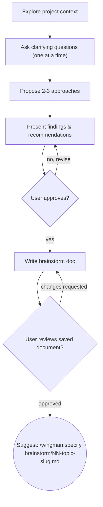

# Brainstorming Ideas Into Clarity

Help turn ideas into well-structured brainstorm documents through natural collaborative dialogue. 

Start by understanding the current project context, then ask questions one at a time to refine the idea. Once you understand what you're building, present the brainstorm results and get user approval.

## Pre-Execution

Invoke `wingman:git-commit` with event `before_brainstorm` before proceeding.

## Checklist

You MUST create a task for each of these items and complete them in order:

1. **Explore project context** — check files, docs, recent commits
2. **Ask clarifying questions** — one at a time, understand purpose/constraints/success criteria
3. **Propose 2–3 approaches** — with trade-offs and a recommendation
4. **Present problem framing, findings & recommendations** — in sections scaled to their complexity, get user approval after each section
5. **Write brainstorm document** — save to `brainstorm/NN-topic-slug.md`
6. **User reviews saved document** — ask user to review the brainstorm file before proceeding
7. **Suggest next step** — present the explicit command to run `/wingman:specify` `brainstorm/NN-topic-slug.md`.

## Process Flow



## The Process

**Understanding the idea:**

- Check out the current project state first (files, docs, recent commits)
- Before asking detailed questions, assess scope: if the request describes multiple independent subsystems (e.g., "build a platform with chat, file storage, billing, and analytics"), flag this immediately. Don't spend questions refining details of a project that needs to be decomposed first.
- If the project is too large for a single brainstorm session, help the user decompose into sub-projects: what are the independent pieces, how do they relate, what order should they be built? Then brainstorm the first sub-project through the normal design flow. Each sub-project gets its own brainstorm → spec → plan → tasks → implementation cycle.
- For appropriately-scoped projects, ask questions one at a time to refine the idea
- Prefer multiple choice questions when possible, but open-ended is fine too
- Only one question per message - if a topic needs more exploration, break it into multiple questions
- Focus on understanding: purpose, constraints, success criteria

**Exploring approaches:**

- Propose 2-3 different approaches with trade-offs
- Present options conversationally with your recommendation and reasoning
- Lead with your recommended option and explain why

**Presenting problem framing, findings & recommendations**

- Once you believe you understand what you're building, present the findings and recommendations
- Scale each section to its complexity: a few sentences if straightforward, up to 200-300 words if nuanced
- Ask after each section whether it looks right so far
- Cover: problem framing, approaches considered, recommended approach, trade-offs, open questions
- Be ready to go back and clarify if something doesn't make sense

**Working in existing codebases:**

- Explore the current structure before proposing changes. Follow existing patterns.
- Where existing code has problems that affect the work (e.g., a file that's grown too large, unclear boundaries, tangled responsibilities), include targeted improvements as part of the brainstorm - the way a good developer improves code they're working in.
- Don't propose unrelated refactoring. Stay focused on what serves the current goal.

## After the Brainstorm

**Documentation:**

- Write the validated brainstorm to `brainstorm/NN-topic-slug.md` — next sequential number (no gap-filling), slug is lowercase hyphenated 2–4 words
  - (User preferences for brainstorm location override this default)

**User Review Gate:**
Ask the user to review the written document before proceeding:

> "Brainstorm saved to `<path>`. Review it and let me know if anything needs changing."

Wait for the user's response. If they request changes, make them. Only proceed once the user approves.

**Next step:**

Ask the user what they would like to do next, offering these choices:
- "Run wingman:specify `brainstorm/NN-topic-slug.md` to create a spec from this brainstorm"
- "I'm done for now"

## Brainstorm Document Structure

```markdown
# Brainstorm: [Topic]

**Date:** YYYY-MM-DD
**Status:** active | parked | abandoned | completed

## Problem Framing
[What problem is being explored and why it matters]

## Approaches Considered

### A: [Approach Name]
- Pros: ...
- Cons: ...

### B: [Approach Name]
- Pros: ...
- Cons: ...

## Decision
[What was chosen and why, or "Parked: [reason]" if no decision was reached]

## Open Threads
- [Unresolved question or idea that needs further exploration]
```

**Status values:** `active` (being pursued), `parked` (may revisit), `abandoned` (not pursuing), `completed` (clear decision reached)

## Post-Execution

Invoke `wingman:git-commit` after completion with event name `after_brainstorm`.

## Incomplete Session Handling

If the session had no meaningful interaction (no approaches explored, no clarifying questions answered), do NOT prompt to save.

For sessions with meaningful interaction, ask: **"Save this brainstorm session?"**
- **Save as parked** — write document with status `parked`
- **Save as abandoned** — write document with status `abandoned`
- **Discard** — no artifacts created

Do NOT suggest running `wingman:specify` for incomplete sessions. The brainstorm must be fully approved before transitioning to specification.

## Key Principles

- **One question at a time** — never overwhelm with multiple questions
- **Multiple choice preferred** — easier to answer than open-ended when possible
- **YAGNI ruthlessly** — remove unnecessary features from consideration
- **Explore alternatives** — always propose 2–3 approaches before settling
- **Incremental validation** — present sections, get approval before moving on
- **Be flexible** - Go back and clarify when something doesn't make sense
